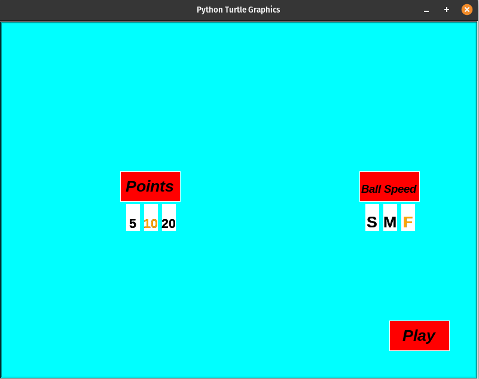
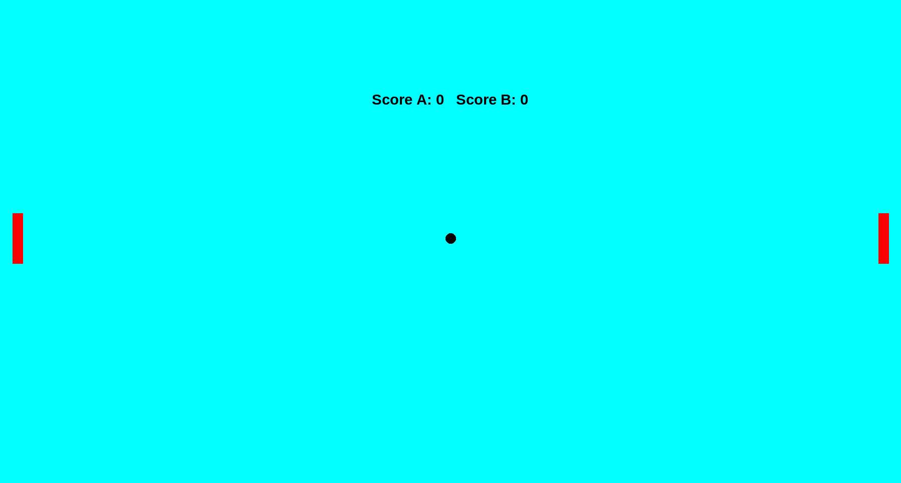

### How to Play?

1. Execute `pong` or run `Python3 pong.py` 
2. Select the no of points(5,10,20) and the Ball_speed(slow,medium,fast)
3. Click on play button
4. Press p to start the game
5. If the game finishes, press r to restart.
6. Player 1: Use `w` / `s` keys to move slider
7. Player 2: Use `Arrow up` / `Arrow down` keys to move slider

### Gameplay

 

 

